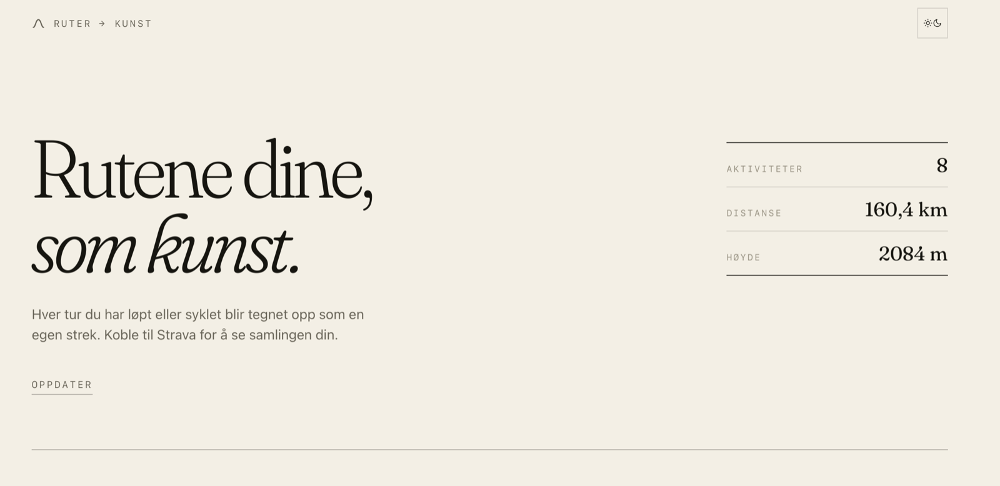
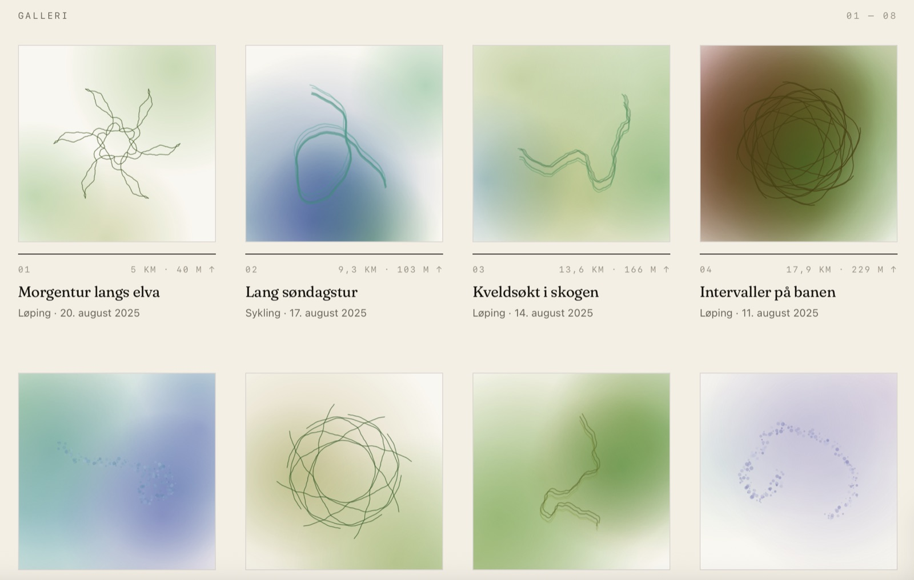

# Strava Art

Turns your Strava activities into generative art. Every run or ride becomes a unique
canvas drawing — and the weather from the day you trained decides how it looks.



## The idea

A GPS track is already a drawing, it just usually gets displayed as a map. This app
takes the route shape and renders it as a poster instead, using the historical weather
at that exact place and time as the palette:

| From the activity | Becomes |
| --- | --- |
| Route polyline | The line drawn on the canvas |
| Temperature | Hue — cold days go blue/purple, warm days go red/orange |
| Weather code (sun, fog, rain, snow, storm) | Render mode: kaleidoscope, flow or particles, plus saturation and layering |
| Activity ID | Random seed, so the same activity always looks the same |



*Same code, eight different days. The clear-weather runs come out as sharp kaleidoscopes,
the rainy ones dissolve into flowing washes, and the sub-zero one turns pale and grainy.
Screenshots use sample data.*

## How it works

```
Browser  ──►  Spring Boot  ──►  Strava API      (OAuth2 + activities)
                        └────►  Open-Meteo API  (historical weather)
```

1. `/login` sends you through Strava's OAuth2 flow; the callback stores the token
   and refreshes it automatically when it expires.
2. `/api/activities` fetches your last 30 activities, decodes each Google-encoded
   polyline into coordinates, and looks up the weather at the route's centroid for
   the hour you started.
3. The frontend draws each activity to a `<canvas>` with the weather-driven style.

## Tech

- **Java 17 + Spring Boot 4** — REST controllers, `RestClient`, service layer, DTO records
- **Vanilla JS + Canvas 2D** — no frontend framework, no build step
- **APIs** — Strava API v3, Open-Meteo historical weather archive
- **Own implementation** — Google polyline decoder written from scratch (`util/PolylineDecoder`)

## Running it

You need a Strava API application ([create one here](https://www.strava.com/settings/api))
with the callback domain set to `localhost`.

Create `src/main/resources/application-local.properties` (git-ignored):

```properties
strava.client-id=your-client-id
strava.client-secret=your-client-secret
strava.redirect-uri=http://localhost:8080/exchange_token
```

Then:

```bash
./mvnw spring-boot:run -Dspring-boot.run.profiles=local
```

Open http://localhost:8080 and click connect. No API key needed for the weather —
Open-Meteo is free and unauthenticated.

## Project layout

```
src/main/java/com/sahra/strava_art/
├── controller/   REST endpoints (auth, activities, weather)
├── service/      Strava OAuth + activity fetching, weather lookup
├── store/        In-memory token storage
├── dto/          Records: ActivityDto, RoutePoint, WeatherInfo, TokenData
└── util/         PolylineDecoder
src/main/resources/static/index.html   Frontend: UI, canvas rendering, dark mode
```

## Notes

- Tokens are kept in memory, so a restart means logging in again — fine for a
  single-user side project, would be a database in production.
- The UI text is in Norwegian.